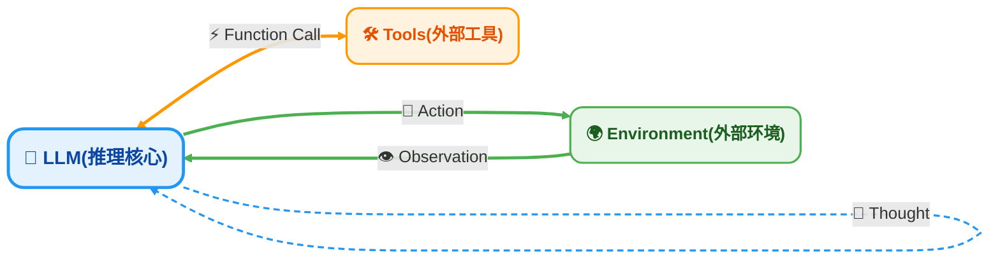
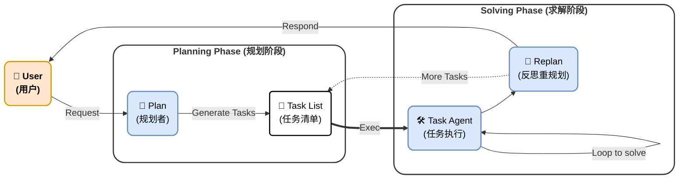
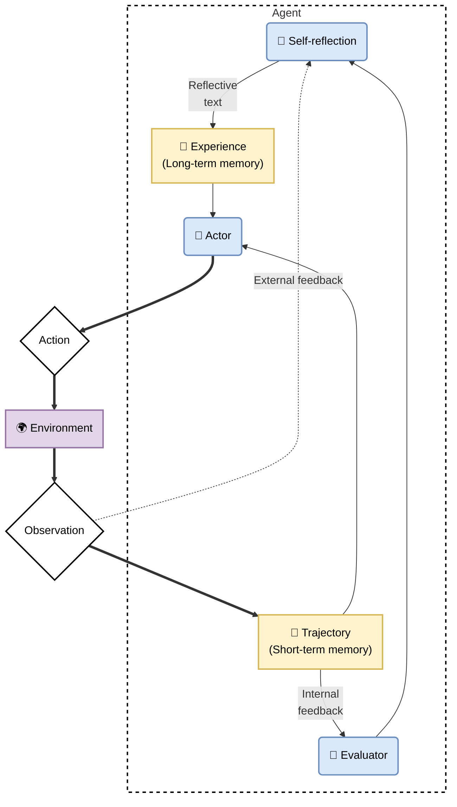

# OpenClaw 爆火：Agent 只是提示词工程 + 字符串匹配吗？

这段时间 OpenClaw 的爆火，引发了业内的广泛讨论，技术人员对 Agent 的热情空前高涨，各大云厂商第一时间提供一键部署功能，资本市场上情绪直接反映到 AI 相关公司的市值上（MiniMax 等大模型公司的股票也大幅上涨，外行人分析）。

为了不被媒体的宣传带偏，我认为对 Agent 背后的原理有一个基本的认识是有必要的，借助[开源书籍](https://datawhalechina.github.io/hello-agents)对于 Agent 的介绍，我目前浅显的认识为 Agent = 提示词工程 + 字符串匹配。

> 本文做出如下假设：LLM 为 Agent 背后的大脑，本文不讨论 LLM，且充分相信它的能力，认为它能够按照提示词的要求生成文本。

书中介绍有三种智能体经典范式，[ReAct](https://arxiv.org/abs/2210.03629)、[Plan-And-Solve](https://arxiv.org/abs/2305.04091)、[Reflection](https://arxiv.org/abs/2303.11366)，下面逐步介绍。

## ReAct

```tex
@misc{yao2023reactsynergizingreasoningacting,
      title={ReAct: Synergizing Reasoning and Acting in Language Models}, 
      author={Shunyu Yao and Jeffrey Zhao and Dian Yu and Nan Du and Izhak Shafran and Karthik Narasimhan and Yuan Cao},
      year={2023},
      eprint={2210.03629},
      archivePrefix={arXiv},
      primaryClass={cs.CL},
      url={https://arxiv.org/abs/2210.03629}, 
}
```

这个架构来自于腾讯首席 AI 科学家姚顺雨的一作 paper，大概的思想如下图所示：



文字解释如下：

- 用户给出一个目标
- Agent 观察到当前环境的状态
- 模型 Thought
- 生成 Action
- 继续上述内容，直至模型的 Action 是 Finish

下图是一个简单的 Loop，LLM 的输出是通过 Prompt 告知 LLM 要生成的文本结构，随后通过字符串匹配提前注册的 Action。


## Plan-and-Solve

```tex
@misc{wang2023planandsolvepromptingimprovingzeroshot,
      title={Plan-and-Solve Prompting: Improving Zero-Shot Chain-of-Thought Reasoning by Large Language Models}, 
      author={Lei Wang and Wanyu Xu and Yihuai Lan and Zhiqiang Hu and Yunshi Lan and Roy Ka-Wei Lee and Ee-Peng Lim},
      year={2023},
      eprint={2305.04091},
      archivePrefix={arXiv},
      primaryClass={cs.CL},
      url={https://arxiv.org/abs/2305.04091}, 
}
```

这个结构的核心思想如下图所示



文字解释如下：

- 用户给出问题
- 规划阶段，思考得到任务清单
- 求解阶段，执行任务并随时更新清单（标记已完成并思考是否需要重新规划）

下图是一个简单的执行过程


## Reflection

```tex
@misc{shinn2023reflexionlanguageagentsverbal,
      title={Reflexion: Language Agents with Verbal Reinforcement Learning}, 
      author={Noah Shinn and Federico Cassano and Edward Berman and Ashwin Gopinath and Karthik Narasimhan and Shunyu Yao},
      year={2023},
      eprint={2303.11366},
      archivePrefix={arXiv},
      primaryClass={cs.AI},
      url={https://arxiv.org/abs/2303.11366}, 
}
```

Reflection（反思）架构的核心在于引入了“自我纠错”机制。如果说 ReAct 是单向的“行动流”，Reflection 则是一个包含了“评价与反馈”的闭环。它的灵感来源于人类在犯错后会进行反思，从而在下一次尝试中避免同样的错误。

这个结构的核心思想如下图所示：





文字解释如下：

- Actor（执行者）：尝试执行任务，产生轨迹（Trajectory）
- Evaluator（评价者）：对执行结果进行打分或判断
- Self-Reflection（反思者）：如果失败，分析失败的原因，生成一段自然语言形式的“反思总结”
- Memory（记忆/上下文更新）：将“反思总结”加入到下一次请求的 Context 中
- Retry（重试）：带着之前的教训，重新尝试执行，直到成功或达到最大重试次数。

## 总结：祛魅 Agent

回到文章开头的假设与论点，在剖析了 OpenClaw 这类 Agent 爆火背后的三大主流范式后，我们可以更清晰地审视“Agent”这个概念。

确实是“提示词工程 + 字符串匹配”的艺术，本质上都是通过精心设计的 Prompt Template（提示词模板） 约束 LLM 的输出格式。而代码层面的工作，主要充当了“胶水”和“解析器”的角色：

- 解析器：用正则表达式或 JSON Parser 提取 LLM 输出的关键词（如函数名、参数、思考内容）。
- 胶水：将提取出的 Action 映射到实际的 API 调用（如搜索 Google、读写文件），并将执行结果（Observation）拼接回 Prompt 字符串，再次喂给 LLM。

如果说 LLM 本身类似于人类的 System 1（快思考，直觉反应），那么 Agent 架构就是通过代码逻辑构建了 System 2（慢思考，逻辑推理）。

- ReAct 赋予了模型“使用工具”和“与其所处环境交互”的能力，打破了 LLM 的知识截止和静态限制。
- Plan-and-Solve 赋予了模型“处理复杂长程任务”的能力，通过分解降低了每一步的推理难度。
- Reflection 赋予了模型“自我进化”和“鲁棒性”，通过试错显著提高了任务的成功率。

OpenClaw 及其同类产品的爆发，并非大模型本身智力发生了质的飞跃，而是工程界终于找到了一套高效的 **Workflow（工作流）**，将 LLM 不稳定的“概率生成”通过工程手段约束在了一个可控、可修正、可执行的“逻辑闭环”中。

对于技术人员而言，理解了这层原理，便不再会被“自主智能”的营销词汇这一层迷雾遮蔽，而是能更专注于如何设计更好的 Prompt 结构，以及如何编写更健壮的 Output Parser 和工具链。

业界真正的 Agent 肯定不是上述这么简单，而是考虑到各种边界条件的完善系统（以下是一些改进）。

- 为了输出稳定性与格式解析：提出结构化解码
- 为了解决长时间运行任务中 Token 消耗巨大、上下文超出窗口限制以及模型“遗忘”关键信息的问题：提出了 RAG
- 等等。

## 关于 Agent 一些看法

我认为：

- 目前的 Agent 是一个工程问题，他的能力受限于 LLM 的“智力”。
- Agent 能够通过持久化记忆（存储到硬盘上）的方式模拟人类的长期记忆。


