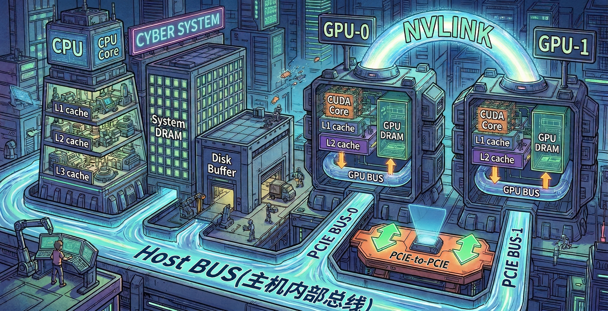

# GPU 显存：AI 的高速粮仓

## 从硬件角度看 GPU 显存

从纯硬件的物理层面来看，显存（VRAM，Video Random Access Memory）本质上是为满足极高数据吞吐需求而定制的存储介质，它是直接焊接在 GPU 芯片旁边的。

从硬件架构的特点来看，显存主要有以下几个核心特征：

### 空间布局：近场通信的极致追求

在普通的电脑主板上，CPU 和内存（系统 RAM）之间是有一定距离的，数据需要经过主板上的线路传输。

而在显卡上，显存芯片（通常是 8 颗或 12 颗黑色的方形芯片）被呈环状或 U 型**直接焊接在 GPU 核心（Die）的周围**。这种物理上“贴脸”的布局，是为了极大缩短电信号的传输距离，从而实现极高的频率和极低的物理延迟。

### 设计哲学：带宽优先的超级公路

普通电脑内存条（DDR）的设计理念是“低延迟”，就像跑车，适合快速响应 CPU 这种喜欢串行处理、需要随时变道的指令。

而显存（GDDR 系列）的设计理念是“**高带宽**”，就像并排开着几十辆重型卡车的 256 车道超级高速公路。GPU 内部拥有数以千计的计算核心，虽然单个核心的指令响应速度（时钟频率）可能不及 CPU，但其优势在于能够并行处理海量数据（同时计算 AI 模型的几百亿个参数）。

### 当今显存的两大硬件形态

为了满足越来越恐怖的数据吞吐需求，目前的显存硬件主要分为两条科技树：

- **GDDR（Graphics Double Data Rate）：平铺式显存**
  - **常见于：** 消费级游戏显卡（如 RTX 4090、RX 7900 XTX）。
  - **形态：** 就是我们在普通显卡拆解图上看到的，围绕在 GPU 核心周围的一圈扁平芯片（如 GDDR6、GDDR6X）。它们的频率被拉得极高。
- **HBM（High Bandwidth Memory）：3D 堆叠式显存**
  - **常见于：** 顶级的 AI 算力卡和数据中心加速卡（如 Nvidia H100、A100）。
  - **形态：** 既然平铺在周围已经无法满足 AI 对带宽的变态需求，工程师干脆把显存芯片像盖楼一样**垂直堆叠**起来，并且使用一种叫“硅中介层（Interposer）”的技术，把显存和 GPU 核心封装在**同一个大芯片模块**里面。
  - **优势：** 这使得数据通道数量呈指数级增加（位宽可达 4096-bit 甚至更高），彻底打破了数据传输的物理瓶颈，这也是顶级 AI 硬件极其昂贵的主要原因之一。

总结来说，在硬件形态上，显存就是与 GPU 核心绑定在一起、拥有超宽数据通道的特种存储芯片集群。

## 从软件角度看显存

如果说从**硬件角度**看，显存是一组拥有超宽高速公路的“物理数据仓库”，那么从**软件和程序员的角度**来看，显存则是一个**需要精打细算、分层管理、且有着严格生命周期的“逻辑地址空间”**。

### 跨界的“物流管理”：Host 与 Device 的数据搬运

在传统的软件视角里，电脑系统的内存（CPU RAM）被称为 **Host（主机端）**，而显存被称为 **Device（设备端）**。

- **显存不是自动获取数据的：** 软件必须像指挥物流一样，明确下达指令。先在显存中申请一块“空地”（如 `cudaMalloc`），然后通过 PCIe 总线，将数据从系统内存**拷贝**到显存中（如 `cudaMemcpy`）。
- **PCIe 是收费站：** 软件开发者非常清楚，显存内部虽然是“256车道”，但系统内存到显存之间的 PCIe 通道却相对狭窄。因此，软件优化的核心逻辑之一就是：**“尽量让数据呆在显存里别出来，算完所有东西再把最终结果拷贝回 CPU。”**

### AI 与深度学习视角下的“账本”：张量（Tensor）的居所

对于现在最火的 AI 开发者（比如使用 PyTorch）来说，显存不再是底层的内存地址，而是被高度抽象为了存放**张量（Tensor）**的容器。当你敲下 `model.to("cuda")` 时，软件眼中的显存被划分为这几大块“预算”：

- **模型权重（Model Weights）：** 显存里的“常驻人口”。比如一个 7B 参数的模型，以 FP16 精度存放，雷打不动就要占据约 14GB 的显存。
- **中间激活值（Activation）：** 显存里的“临时工”。在训练神经网络时，前向传播产生的中间结果必须保存在显存里，等待反向传播计算梯度时使用。这是导致训练时显存爆炸（OOM，Out of Memory）的罪魁祸首。
- **优化器状态和梯度（Optimizer States & Gradients）：** 显存里的“记账本”。训练时用来更新模型参数，同样会占据海量空间。
- **KV Cache（推理专属）：** 大语言模型在生成文本时，软件会在显存中开辟一块动态空间来缓存历史上下文，以换取生成速度。

### 现代软件的“终极幻觉”：统一内存（Unified Memory）

为了降低编程难度，现代显卡驱动和软件框架创造了一种“幻觉”：

在过去，程序员必须手动管理 CPU 内存和 GPU 显存之间的数据移动。而现在，通过 **统一虚拟寻址（UVA）**甚至更高级的统一内存池，软件可以假装 CPU 和 GPU 共享了同一个内存空间。

开发者只需要分配一次内存，系统底层的软件驱动会像“智能管家”一样，根据 CPU 和 GPU 谁在处理数据，自动把数据在系统内存和显存之间“偷梁换柱”地进行页面迁移（Paging），极大简化了开发流程。

## 总结

如果把 **GPU** 比作一个拥有几千名员工的**超级工厂**，那么：

1. **显存**就是工厂内部的**零距离仓库**，搬运工出门即达，且大门极宽。
2. **系统内存**则是远在市区的**中心仓库**。
3. **PCIe 总线**是连接两个仓库的**单车道小路**。

**优秀的软件优化**，就是尽量把原料一次性拉进工厂仓库（显存），让工人们在厂里闷头干活，而不是频繁派车回市区拉货。
