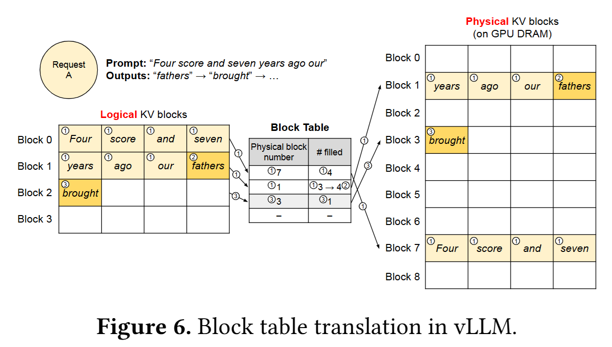
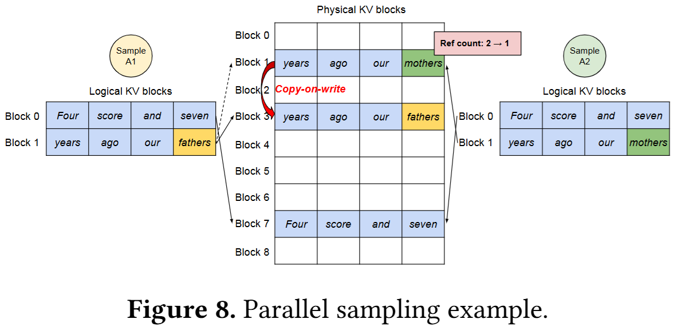
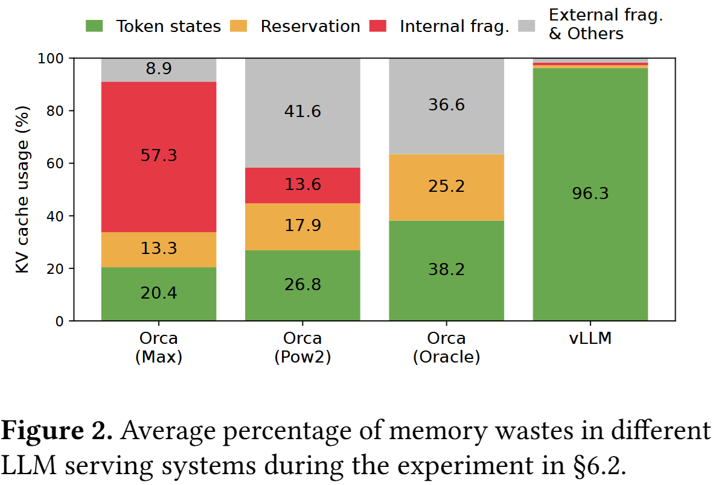

# vLLM 的 PagedAttention：KV cache 为什么要分页

Paged attention 是 vLLM 的核心机制之一，它借鉴操作系统中虚拟内存和分页的思想，将存放在 GPU 显存中的 KV cache 划分为固定大小的块，并通过逻辑块到物理块的映射实现非连续存储，从而减少显存浪费和碎片。

在本文正式开始之前，先做一些名词约定，以免产生歧义：

- token：文本经过 tokenizer 切分后得到的最小离散单元
- token id：token 在词表中的整数编号
- token embedding：token 在进入第一层 transformer 之前的初始向量表示
- hidden states：序列中各位置在某一层的表示矩阵
  - hidden state：序列中某一个位置对应的单个表示向量

前置知识需求：causal self-attention

## 大模型推理的两个阶段

- prefill：一次性并行处理用户输入的全部 prompt，完成模型的前向计算，生成并缓存各位置对应的 K、V 向量，同时得到用于预测第一个生成 token 的 logits。
- decode：逐一生成新 token，每一步仅输入上一轮生成的单个 token，利用历史缓存的 KV 向量计算注意力，避免重复处理已有的历史序列。

## KV cache

Paged attention 主要解决的是 KV cache 在推理过程中的存储和访问问题，因此需要先理解 KV cache 的含义。

### KV cache 是什么

Attention 层的输入是由各个位置的 hidden state 组成的矩阵。在计算过程中，每个位置的 hidden state 会进一步映射得到对应的 $Q$、$K$ 和 $V$。

在自回归推理中，历史位置对应的 $K$ 和 $V$ 会在后续解码过程中被反复使用。为了避免后续解码时重复计算，通常会将各层 attention 中历史位置对应的 $K$ 和 $V$ 缓存在显存中，供直接读取，这便是 KV cache。

### KV cache 怎么缓存

KV cache 的建立主要发生在推理的 prefill 阶段。

在 prefill 阶段，模型会对输入 prompt 的所有位置做一次完整前向计算。对于每一层 attention，模型都会根据该层输入的 hidden states 计算出这一层所有位置对应的 $K$ 和 $V$，并将它们按位置顺序写入显存中。

因此，当 prefill 结束后，prompt 中所有历史位置在各层 attention 对应的 $K$ 和 $V$ 就都已经被缓存好了。

### KV cache 怎么使用

在大模型推理的自回归解码阶段，设某一层 attention 已经处理了前 $t$ 个位置，并缓存了这些位置对应的 $K$ 和 $V$。当输入到该层的序列末尾新增第 $t+1$ 个位置，其输入 hidden state 为 $x_{t+1}$ 时，模型会先计算该位置对应的 $q_{t+1}$、$k_{t+1}$ 和 $v_{t+1}$。

随后，用 $q_{t+1}$ 与历史缓存的 $K$ 以及当前新产生的 $k_{t+1}$ 计算注意力分数；经过归一化后，再对历史缓存的 $V$ 以及当前的 $v_{t+1}$ 做加权求和，从而得到这一层 attention 在第 $t+1$ 个位置的输出 hidden state。

在这一过程中，历史位置对应的 $K$ 和 $V$ 都直接从 KV cache 中读取，模型只需要为新增位置计算新的 $q$、$k$、$v$。这就避免了对历史位置的重复计算。在这个过程中，新计算出来的 $k$、$v$ 均会加入到当前层的 KV cache 里面去。

### KV cache 的前提

KV cache 能够成立，依赖于 causal self-attention。

在 causal self-attention 中，第 $i$ 个位置只能关注自身及其之前的位置，而不能关注之后新增的位置。因此，当序列末尾新增一个位置时，历史位置的输出 hidden states 不会发生变化，进一步由这些 hidden states 计算得到的 $K$ 和 $V$ 也保持不变。

正因为如此，历史位置对应的 $K$ 和 $V$ 才可以被安全地缓存下来，在后续解码过程中被直接复用。

## 传统连续式 KV cache 的问题

如果把 KV cache 作为一段连续的大 buffer 来管理，通常会遇到下面三个问题。

### 预分配导致的显存浪费

为了避免解码过程中频繁扩容，系统通常会提前为请求预留一段较大的连续显存空间。但在生成早期，实际写入的 token 还不多，这段预留空间的大部分都处于未使用状态，造成显存浪费。

### 扩容带来的数据复制开销

如果序列长度超过了最初预留的空间，而 KV cache 又必须保持连续存储，就需要重新申请一段更大的连续 buffer，并把已有的 KV 数据复制过去。这样不仅会带来额外的数据搬移开销，还可能引入明显的扩容延迟。

### 连续分配导致的显存碎片

连续式 KV cache 依赖较大的连续显存块。这样一来，即使显存中还有不少零散空闲空间，也可能因为找不到足够大的连续区域而无法完成新的分配，从而加剧显存碎片问题。

## Paged attention 核心思路

前一节的几个问题，本质上都来自同一个约束：KV cache 被当作一段连续的大 buffer 来管理。Paged attention 的思路是，不再要求每个请求的 KV cache 在物理内存中连续存放，而是把它拆成固定大小的 block，按需分配物理 block，并用 block table 维护逻辑块到物理块的映射。

这样一来，序列增长时不需要整体扩容和搬移已有 KV 数据，显存浪费也可以从“整段预留空间”收敛到“最后一个未填满的 block”这一粒度。

### 逻辑块和物理块的映射

如下图所示，系统通过 block table 将逻辑 block 映射到实际存放数据的 physical block：

- **逻辑层**：先把每个 request 的 KV cache 按照固定大小切成多个逻辑 block。对请求本身来说，它看到的仍然是一串按顺序排列的连续空间。
- **物理层**：真实的 KV 数据存放在全局 physical block 池中，在显存中不要求连续。随着序列增长，系统只需按需分配新的 physical block。
- **映射层**：block table 负责记录每个逻辑 block 对应到哪个 physical block，并保持实时更新。

这种映射方式直击了传统连续分配的三个痛点。具体的收益分析我们将在后文详细展开。

### Block 复用与 Copy-on-Write

这种映射方式不仅便于按需分配，也让具有相同前缀的多个请求能够共享已有的 physical block。Parallel sampling 就是一个典型例子。

如下图所示，Sample A1 和 Sample A2 的前缀是一样的，所以它们的 KV cache 一开始可以复用同一批 physical blocks

- 完全相同的前缀 block 直接复用
- 如果末尾 block 还没有发生写入分歧，也可以先共享
- 因此，多个请求在逻辑上彼此独立，但在物理上可以共享底层 block

当后续生成的 token 开始不同，系统再决定是否分裂这些共享 block

- 如果某个 shared physical block 的引用计数大于 1，且本次写入会修改它，就触发 copy-on-write，先复制出一个新的 block，再在新 block 上写入
- 如果该 block 的引用计数已经降为 1，就可以直接原地写入，而不需要额外复制

### Paged attention 的 kernel 执行思路

前面讲的是 KV cache 如何按 block 分页存储，但我读到这里时还有一个问题：attention 计算到底怎么在这种非连续布局上跑起来？为了弄清楚这一点，我又去看了 `paged_attention_kernel` 的源码。这个算子本身很长，细节也很多，所以这里先只抓整体执行思路。

Paged attention 的做法是，kernel 不再假设 KV cache 在物理内存中连续，而是通过 block table 按逻辑顺序找到当前请求对应的 physical block，再逐个 block 读取其中的 K 和 V，完成 attention 计算。

对于当前生成位置的 query，kernel 会依次处理它需要关注的那些逻辑 block：

  - 先通过 block table 找到这个逻辑 block 对应的 physical block
  - 读取该 block 中存放的 K 和 V
  - 计算 query 与这一 block 内各个 key 的 attention 分数
  - 维护这一 block 对 softmax 归一化和最终输出的中间结果
  - 再结合对应的 value，累积这一 block 对输出的贡献
  - 等所有相关 block 都处理完之后，再把这些中间结果合并，得到当前 query 的最终 attention 输出。

换句话说，Paged attention 改变的是 KV cache 的物理存储方式，但没有改变 attention 在逻辑上看到的序列顺序。对模型来说，它关注的仍然是同一段历史；只是 kernel 现在需要借助 block table，在分页布局上把这些历史 token 对应的 K 和 V 找出来并完成计算。

## Paged attention 带来的收益

Paged attention 并没有改变 attention 的计算结果，它优化的是推理阶段 KV cache 的组织和访问方式。因此，它带来的收益主要体现在显存利用率和服务吞吐上。

### 提高 KV cache 的显存利用率

传统连续式 KV cache 往往需要预留较大的连续 buffer。这样做虽然实现简单，但容易把显存浪费在预留空间、内部碎片和外部碎片上。

Paged attention 把 KV cache 的分配单位从“大段连续 buffer”变成了固定大小的 block。这样一来，系统只需要按需分配 physical block，不再要求为整个序列预留一整段连续空间，显存浪费通常也被限制在最后一个未填满的 block 上。

这一点可以从论文中的对比图更直观地看出来。在 Orca 系列方案中，KV cache 的一大部分空间会浪费在 reservation 和 fragmentation 上；而在 vLLM 中，绝大多数显存都被真正用于存放 token 对应的状态，KV cache 的利用率明显更高。

### 降低扩容与碎片带来的额外开销

当序列继续增长时，Paged attention 只需要追加新的 physical block，而不需要重新申请更大的连续 buffer，再把已有 KV 数据整体搬移过去。这降低了扩容时的数据复制开销，也减弱了系统对大块连续显存的依赖，从而缓解显存碎片问题。

### 支持前缀共享，减少重复缓存

Paged attention 还有一个额外收益：当多个请求拥有相同前缀时，它们可以直接共享对应的 physical block，而不必各自维护一份完全相同的 KV cache。对于 parallel sampling、beam search 这类场景，这可以进一步减少显存占用。

### 在相同显存预算下支撑更高吞吐

前面的几个收益叠加起来，最终带来的系统级结果是：在相同的 GPU 显存预算下，服务端可以容纳更多并发请求，或者支持更长的上下文长度，从而提升整体吞吐。

## 总结

总结来看，Paged attention 可以理解成：**KV cache 的分页管理机制 + 适配这种分页布局的 attention 实现**。

它通过打破显存必须连续分配的物理限制，将操作系统的分页思想引入大模型推理，从根本上解决了显存碎片和预分配浪费问题。这不仅极大提升了显存利用率，更使得在相同硬件条件下大幅提高系统并发吞吐成为可能。

## 参考资料

- [GPT-5.4](https://chatgpt.com/)
- [KV cache](https://huggingface.co/blog/not-lain/kv-caching)
- [vLLM 的 paged attention 设计文档](https://docs.vllm.ai/en/latest/design/paged_attention)
- [PagedAttention 原始论文](https://arxiv.org/abs/2309.06180)
- [vLLM](https://github.com/vllm-project/vllm)
- [图解大模型计算加速系列之：vLLM核心技术PagedAttention原理](https://zhuanlan.zhihu.com/p/691038809)
