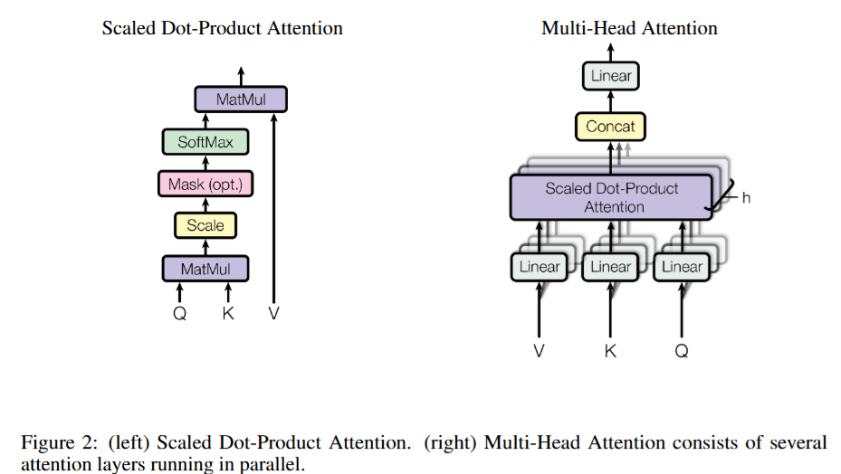
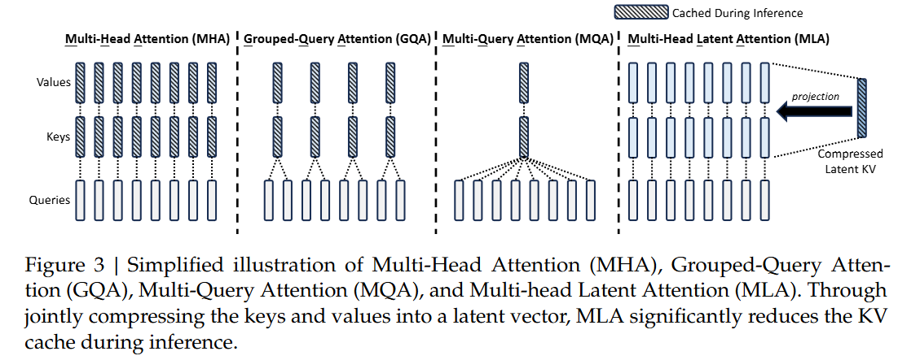
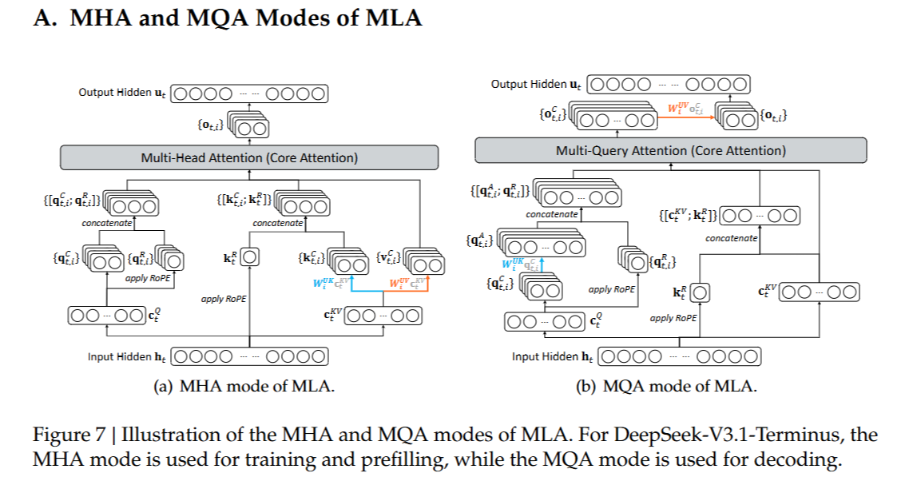
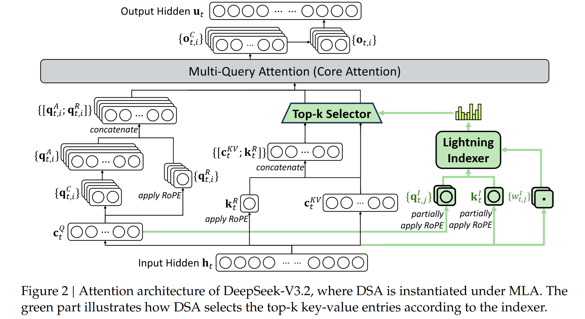
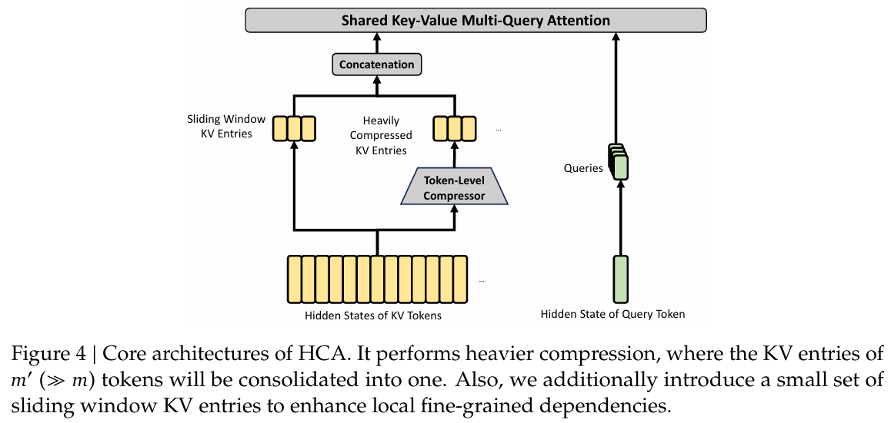
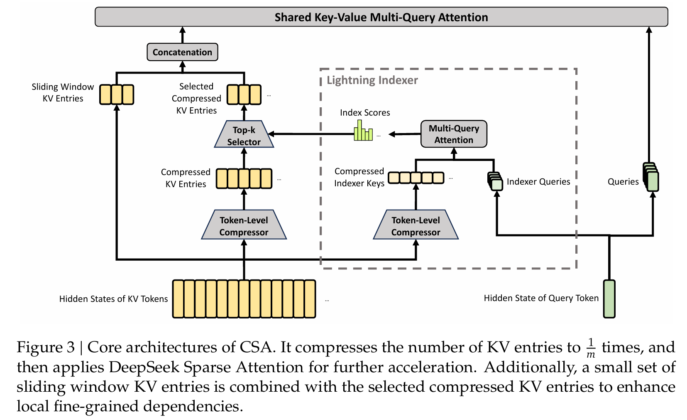

# 从 MHA、GQA 到 MLA、DSA、HCA/CSA：DeepSeek 文本大模型 Attention 架构演进

本文将介绍 DeepSeek 各代主线模型使用的 attention 架构。每一个 attention 将分为直觉解释、per hidden state 的数学计算过程展示以及总结部分。（本文默认是 attention 的 decode 阶段）

阅读建议：

- 直觉解释（必读）：快速了解每一个 attention 的全貌，了解 attention 为什么要做出这种架构改变
- 数学计算过程展示（选读）：可以更加深刻的理解 attention 架构改变的 memory、compute 的权衡

前置知识：朴素 Attention、KV cache、RoPE

注：对于 norm 部分均不考虑，只看 attention 本身

## 速览版

按时间顺序看：

- **DeepSeek LLM 7B**：使用标准 **MHA**，每个 query head 都有自己独立的 key/value head。
- **DeepSeek LLM 67B**：使用 **GQA**，多个 query head 共享较少数量的 key/value head，直接降低 KV cache。
- **DeepSeek-V2 / V3 / R1**：引入 **MLA**，不再直接缓存完整 key/value，而是缓存压缩后的 latent KV，并通过矩阵吸收减少恢复 K/V 的开销。
- **DeepSeek-V3.2 / V3.2-Exp**：在 MLA 之上引入 **DSA**，用 lightning indexer 先筛出 topk 重要 token，再执行真正的 attention，重点降低长上下文下的 attention 计算量。
- **DeepSeek-V4**：继续思考如何降低 compute 和 memory，演化出 HCA 和 CSA（其中 HCA 高效压缩，CSA 在稍微次一点压缩的基础上与 DSA 思想结合）

## MHA

> DeepSeek LLM 7B 开源于 2023 年 11 月 29 日，采用了 MHA 作为它的注意力

**M**ulti **H**ead **A**ttention

### 直觉解释

标准 MHA 的核心思想是：把 hidden state 投影成多个子空间中的 query、key、value，每个 head 独立做 attention，最后把所有 head 的输出拼接起来。

- 它的优点很直接：每个 head 都有独立的 Q/K/V 投影，表达能力强
- 缺点也很明显：每个 head 都需要缓存自己的 key 和 value

在自回归生成阶段，模型会一个 token 一个 token 地生成。假设已经处理完前 $t-1$ 个 token，现在要继续生成第 $t$ 个 token。由于 causal mask 的存在，前面 token 的 hidden state 不会因为新 token 加入而变化，因此前面 token 对应的 K/V 也不需要重新计算。于是推理系统会把过去的 K/V 存起来，这就是 KV cache。

KV cache 节省了重复计算，但把问题转移到了显存上：上下文越长、层数越多、head 越多，缓存越大。长上下文推理时，MHA 的瓶颈往往不是算不动，而是 KV cache 读写带宽和显存容量。

### 数学计算过程

预定义变量：

- $d_{model}$：模型 hidden size
- $h$：attention head 数
- $d_h$：每个 head 维度，$d_h \cdot h=d_{model}$，这里定义 $d_q=d_v=d_k=d_h$
- $h_i^{(l)}$：第 $l$ 层 attention 输入的第 $i$ 个位置的 hidden state，假定一共有 $L$ 层

计算注意力权重：第 $t$ 个位置 query 第 $i$ 个位置得到的 softmax 注意力权重 $\alpha_{t,i}^{(l,r)}$
$$
\alpha_{t,i}^{(l,r)}=\frac{\exp (\frac{q_t^{(l,r)} (k_i^{(l,r)})^\top}{\sqrt {d_h}})}{\sum_{j=1}^{t}\exp(\frac{q_t^{(l,r)} (k_j^{(l,r)})^\top}{\sqrt {d_h}})}\\
q_t^{(l,r)}=h_t^{(l)} W_q^{(l,r)} \in \mathbb {R}^{1\times d_k},\quad W_q^{(l,r)}\in\mathbb R^{d_{model}\times d_k}\\
k_i^{(l,r)}=h_i^{(l)} W_k^{(l,r)} \in \mathbb {R}^{1\times d_k},\quad W_k^{(l,r)}\in\mathbb R^{d_{model}\times d_k}\\
v_i^{(l,r)}=h_i^{(l)} W_v^{(l,r)} \in \mathbb {R}^{1\times d_v},\quad W_v^{(l,r)}\in\mathbb R^{d_{model}\times d_v}\\
h_i^{(l)},h_t^{(l)}\in\mathbb{R}^{1\times d_{model}}
$$
计算单个 head 的输出：第 $t$ 个位置在第 $r$ 个 head 上的输出
$$
o_t^{(l,r)}=\sum_{i=1}^t\alpha_{t,i}^{(l,r)}v_i^{(l,r)}
$$
concat 多个 head：attention 的输出由多个 head 的输出 concat 而成
$$
o_t^{(l)}=[o_t^{(l,1)}, o_t^{(l,2)},...,o_t^{(l,h)}]
$$
输出投影：
$$
y_t^{(l)}=o_t^{(l)}W_o^{(l)},\quad W_o^{(l)}\in\mathbb R^{h d_h\times d_{model}}
$$

### KV cache 的补充推导

情景说明：假设模型已经根据前 $t-1$ 个 token 预测出了第 $t$ 个 token，接下来需要继续预测第 $t+1$ 个 token。

为了预测第 $t+1$ 个 token，需要将刚生成的第 $t$ 个 token 作为新的输入 token。由于是 causal attention，在 decode 阶段追加新 token 不会改变前 $t-1$ 个位置在第 $l$ 层的 hidden state $h_{\le t-1}^{(l)}$，因此它们对应的 $k_{\le t-1}^{(l,r)}$ 和 $v_{\le t-1}^{(l,r)}$ 也不需要重新计算。

推理系统会将这些历史 K/V 保存下来，作为已有的 KV cache。此时只需要计算当前 token 的 $k_t^{(l,r)}$、$v_t^{(l,r)}$，并将它们追加到已有 cache 中，得到 $k_{\le t}^{(l,r)}$、$v_{\le t}^{(l,r)}$，用于后续预测。

KV cache 的显存占用：
$$
KVcache=2\cdot length_{context} \cdot L \cdot d_h \cdot h \cdot bytes
$$

注：$l$ 这个变量是为了说明 KV cache 才加入的，现在已经说明了 KV cache 存在的意义，后面我将去除这个变量。

## GQA

> DeepSeek LLM 67B 也开源于 2023 年 11 月 29 日，采用了 GQA 作为它的注意力

**G**rouped **Q**uery **A**ttention

### 直觉解释

前面 MHA 推导 KV cache 的过程中，我们知道需要存放 $k_{\le t-1}^{(l,r)}$ 和 $v_{\le t-1}^{(l,r)}$，那么随着上下文长度的增加，KV cache 将占用大量显存，如何减少 KV cache 的显存占用就成为了一个研究课题，有不同的研究方向，其中 paged attention 是从 KV cache 的内存管理角度降低显存碎片和浪费，提高显存利用率，而 GQA 的主要逻辑目标是降低 KV cache 存储和读取压力。

MHA 的每一个 head 有独立 query、key、value，GQA 是让 $h_q$ 个 query head 划分为 $n_g=h_{kv}$ 组，每组 query heads 共享相同的 key/value head，从而将 KV cache 的内存占用减少为原来的 $\frac{h_{kv}}{h_q}$。

### 数学计算过程

预定义变量：

- $d_{model}$：模型 hidden size
- $h_q$：query head 数
- $h_{kv}$：key/value head 数
- $d_h$：每个 head 维度，$d_h \cdot h_q=d_{model}$，这里定义 $d_q=d_v=d_k=d_h$
- $h_i$：attention 输入的第 $i$ 个位置的 hidden state

计算注意力权重：第 $t$ 个位置 query 第 $i$ 个位置得到的 softmax 注意力权重
$$
\alpha_{t,i}^{(r)}=\frac{\exp (\frac{q_t^{(r)} (k_i^{(s)})^\top}{\sqrt {d_h}})}{\sum_{j=1}^{t}\exp(\frac{q_t^{(r)} (k_j^{(s)})^\top}{\sqrt {d_h}})}\\
q_t^{(r)}=h_t^{} W_q^{(r)} \in \mathbb {R}^{1\times d_k},\quad W_q^{(r)}\in\mathbb R^{d_{model}\times d_k}\\
k_i^{(s)}=h_i^{} W_k^{(s)} \in \mathbb {R}^{1\times d_k},\quad W_k^{(s)}\in\mathbb R^{d_{model}\times d_k}\\
v_i^{(s)}=h_i^{} W_v^{(s)} \in \mathbb {R}^{1\times d_v},\quad W_v^{(s)}\in\mathbb R^{d_{model}\times d_v}\\
h_i,h_t\in\mathbb{R}^{1\times d_{model}}
$$

计算单个 head 的输出：第 $t$ 个位置在第 $r$ 个 query head 上的输出（第 $r$ 个 query head 对应第 $s$ 个 key/value head，即 $s=\mathbf {kv}(r)$）
$$
o_t^{(r)}=\sum_{i=1}^t\alpha_{t,i}^{(r)}v_i^{(s)}
$$

concat 多个 head：attention 的输出由多个 query head 的输出 concat 而成
$$
o_t=[o_t^{(1)}, o_t^{(2)},...,o_t^{(h_q)}]
$$

输出投影：
$$
y_t=o_tW_o,\quad W_o\in\mathbb R^{h_q d_h\times d_{model}}
$$

## MLA

> DeepSeek-V2、DeepSeek-V3、DeepSeek-R1 均采用 MLA 作为注意力

### 直觉解释

GQA、MQA 是通过减少 key/value head 数量来降低 KV cache 显存占用；MLA 则换了一个角度，不再直接缓存完整的 K/V，而是将其中可压缩的部分表示为 latent KV。

这里的关键在于 RoPE 不能直接和这部分 latent KV 混在一起处理，这是因为 MLA 后续希望直接基于 latent KV 完成 attention 计算，而不是先把完整 K/V 显式恢复出来；但 RoPE 会把位置信息注入到 query/key 的点积中，如果把 RoPE 也放进 latent KV 路径，就会破坏这种“不显式恢复 K/V”的计算方式。

因此，MLA 将 query/key 拆成 nope 和 rope 两部分：nope 部分走 latent KV 路径，用于降低 KV cache；rope 部分则单独计算并缓存 decoupled RoPE key，用来保留位置信息。这样既能减少 KV cache，又能兼容 RoPE。

### 数学计算过程

预定义变量：

- $d_{model}$：模型 hidden size
- $h$：attention head 数
- $d_{nope}$：每个 head 中不带 RoPE 的 query/key 维度
- $d_{rope}$：每个 head 中带 RoPE 的 query/key 维度
- $d_v$：每个 value head 的维度
- $d_{q,latent}$：query 的 latent 维度
- $d_{kv,latent}$：key/value 的 latent 维度
- $h_i$：attention 输入的第 $i$ 个位置 hidden state

计算注意力权重：第 $t$ 个位置 query 第 $i$ 个位置得到的 softmax 注意力权重
$$
\alpha_{t,i}^{(r)}=\frac{\exp (\frac{q_t^{(r)} (k_i^{(r)})^\top}{\sqrt {d_{nope}+d_{rope}}})}{\sum_{j=1}^{t}\exp(\frac{q_t^{(r)} (k_j^{(r)})^\top}{\sqrt {d_{nope}+d_{rope}}})}\\

q_t^{nope,(r)}=c_t^{Q} W_q^{nope,(r)} \in \mathbb {R}^{1\times d_{nope}},\quad W_q^{nope,(r)}\in\mathbb R^{d_{q,latent}\times d_{nope}}\\

q_{t}^{rope,(r)}=\operatorname{RoPE}_t\left(c_t^{Q} W_q^{rope,(r)}\right)\in\mathbb{R}^{1\times d_{rope}}, \quad W_q^{rope,(r)} \in \mathbb R ^{d_{q,latent}\times d_{rope}} \\

q_t^{(r)}=[q_t^{nope,(r)}, q_{t}^{rope,(r)}] \\\\

k_i^{nope,(r)}=c_i^{KV} W_k^{nope,(r)} \in \mathbb {R}^{1\times d_{nope}},\quad W_k^{nope,(r)}\in\mathbb R^{d_{kv,latent}\times d_{nope}}\\

k_{i}^{rope}=\operatorname{RoPE}_i\left(h_i W_k^{rope}\right)\in\mathbb{R}^{1\times d_{rope}}, \quad W_k^{rope} \in \mathbb R ^{d_{model}\times d_{rope}} \\
k_i^{(r)}=[k_i^{nope,(r)}, k_{i}^{rope}] \\\\

v_i^{(r)}=c_i^{KV} W_v^{(r)} \in \mathbb {R}^{1\times d_v},\quad W_v^{(r)}\in\mathbb R^{d_{kv,latent}\times d_v} \\\\

c_t^{Q}=h_tW_c^{Q}\in\mathbb R^{1\times d_{q,latent}}, \quad W_c^{Q}\in\mathbb R^{d_{model}\times d_{q,latent}}\\

c_i^{KV}=h_iW_c^{KV}\in\mathbb R^{1\times d_{kv,latent}}, \quad W_c^{KV}\in\mathbb R^{d_{model}\times d_{kv,latent}}\\
$$
计算单个 head 的输出：第 $t$ 个位置在第 $r$ 个 query head 上的输出
$$
o_t^{(r)}=\sum_{i=1}^t\alpha_{t,i}^{(r)}v_i^{(r)}
$$

concat 多个 head：attention 的输出由多个 query head 的输出 concat 而成
$$
o_t^{}=[o_t^{(1)}, o_t^{(2)},...,o_t^{(h)}]\in\mathbb R^{1\times hd_v}
$$

输出投影：
$$
y_t=o_tW_o,\quad W_o\in\mathbb R^{h d_v\times d_{model}}
$$

### MLA 中的 cache 详细分析

先记住MLA 缓存的部分是 $c_{i}^{KV}$ 和 $k_i^{rope}$，接下来我将说明为什么这么做

- $c_{i}^{KV}$：用来恢复 $k_i^{nope,(r)}$ 和 $v_i^{(r)}$
- $k_i^{rope}$：RoPE 部分由 $h_i$ 直接算出，且所有 head 共享

根据前面的计算过程分析，这种 latent vector 可以减少 KV cache 的显存占用，但是如果需要显式恢复原始的 key/value，计算量反而比没有使用 latent vector 的多，与一开始使用 latent vector 的目的相悖。

下面将介绍如何通过数学的方式来避免显式恢复 key/value。

避免显式恢复 key：
$$
\begin{aligned}
q_t^{nope,(r)}
\left(k_i^{nope,(r)}\right)^\top
&=
c_t^{Q} W_q^{nope,(r)}
\left(c_i^{KV} W_k^{nope,(r)}\right)^\top \\

&=
c_t^{Q} W_q^{nope,(r)}
\left(W_k^{nope,(r)}\right)^\top
\left(c_i^{KV}\right)^\top \\

&=
c_t^{Q}
\underbrace{
W_q^{nope,(r)}
\left(W_k^{nope,(r)}\right)^\top
}_{W_{qk}^{absorb,(r)}}
\left(c_i^{KV}\right)^\top \\

&=
c_t^{Q}
W_{qk}^{absorb,(r)}
\left(c_i^{KV}\right)^\top
\end{aligned}
\\W_q^{nope,(r)}\in\mathbb R^{d_{q,latent}\times d_{nope}}, W_k^{nope,(r)}\in\mathbb R^{d_{kv,latent}\times d_{nope}}\\
W_{qk}^{absorb,(r)}\in\mathbb R^{d_{q,latent}\times d_{kv,latent}}
$$
避免显式恢复 value（考虑 attention 之后的投影矩阵）：
$$
\begin{aligned}
y_t
&=
o_t W_o \\

&=
\sum_{r=1}^{h}
o_t^{(r)} W_o^{(r)} \\

&=
\sum_{r=1}^{h}
\left(
\sum_{i=1}^{t}
\alpha_{t,i}^{(r)}
v_i^{(r)}
\right)
W_o^{(r)} \\

&=
\sum_{r=1}^{h}
\left(
\sum_{i=1}^{t}
\alpha_{t,i}^{(r)}
c_i^{KV} W_v^{(r)}
\right)
W_o^{(r)} \\

&=
\sum_{r=1}^{h}
\left(
\sum_{i=1}^{t}
\alpha_{t,i}^{(r)}
c_i^{KV}
\right)
W_v^{(r)}
W_o^{(r)} \\

&=
\sum_{r=1}^{h}
\left(
\sum_{i=1}^{t}
\alpha_{t,i}^{(r)}
c_i^{KV}
\right)
\underbrace{
W_v^{(r)}
W_o^{(r)}
}_{W_{vo}^{absorb,(r)}} \\

&=
\sum_{r=1}^{h}
\left(
\sum_{i=1}^{t}
\alpha_{t,i}^{(r)}
c_i^{KV}
\right)
W_{vo}^{absorb,(r)}
\end{aligned}
\\
c_i^{KV}
\in \mathbb{R}^{1 \times d_{kv,latent}},W_v^{(r)} \in \mathbb{R}^{d_{kv,latent} \times d_v},
W_o^{(r)} \in \mathbb{R}^{d_v \times d_{model}}
\\
y_t \in \mathbb{R}^{1 \times d_{model}}
$$
上面推导过程可知，non-RoPE key 部分和 value 部分都可以通过矩阵融合的方式避免显式恢复；RoPE key 部分则已经以 $k_i^{rope}$ 的形式单独缓存。

上述过程，在后续的 DeepSeek-V3.2 论文中被认为是 MQA-mode 的 MLA，也是后续该论文中 DSA 的实例化基础。

- MHA-mode MLA：不 absorb 的版本
- MQA-mode MLA：前面 absorb 矩阵之后的版本

## DSA

> DeepSeek-V3.2

### 直觉解释

前面的 GQA 和 MLA 本质上都是从减少显存占用的角度来考虑推理优化的，而 DSA 再次把优化方向拉回到 attention 计算量本身。简要地说，就是先用一个轻量级打分器，也就是图中的 lightning indexer，对历史 token 做相关性打分；然后通过 topk selector 选出分数最高的若干位置，主 attention 只对这些位置对应的 k/v 做正常 attention。需要注意的是，DSA 并不是完全跳过历史 token，lightning indexer 仍然会以较低成本扫描历史位置来计算 index score，只是后续真正昂贵的 attention 计算只发生在 topk 选中的 token 上。

如下图所示，图中提到它是基于 MLA 实例化的 DSA，这是因为 DeepSeek-V3.1-Terminus 的 attention 是 MLA，而 DeepSeek-V3.2 是继续在 DeepSeek-V3.1-Terminus 的 checkpoint 上训练的。

### 数学计算过程

上图是特例化的 DeepSeek Sparse Attention，而关于 DSA 原型则只需要关注 lightning indexer 和 topk selector。下面我将先介绍 lightning indexer 和 topk selector 的数学表达，然后再将其实例化到上图的状态中。

额外预定义变量（采用上标 $I$ 来表示 indexer 相关的变量）：

- $h^I$：indexer head 数
- $d^I$：indexer head 维度
- $q_{t,j}^{I}$：第 $t$ 个位置在第 $j$ 个 indexer head 上的 indexer query
- $k_i^{I}$：第 $i$ 个位置的 indexer key
- $\omega_{t,j}^{I}$：第 $t$ 个位置对第 $j$ 个 indexer head 的加权系数

第 $t$ 个位置 query 第 $i$ 个位置的 index score（这里暂时不介绍 $q_{t,j}^{I}$ 和 $k_i^{I}$ 从何处映射而来，因为不同 attention 里面的实现方式不同，后面将介绍其在 MLA 里面的实现）：
$$
S^I_{t,i}=\sum_{j=1}^{h^I}\omega_{t,j}^I\cdot\text{ReLU}(q^I_{t,j}{(k_{i}^I)}^\top)
$$
额外预定义变量（补充）：

- $k$：选取分数最高的 $k$ 个位置
- $\mathcal{S}_t$：第 $t$ 个位置选出来的分数最高的 $k$ 个位置组成的序号集合（暂时还不需要 topk 的具体实现）

在 MLA 之上实例化的 DSA

总体预定义变量：

- $d_{model}$：模型 hidden size
- $h$：attention head 数
- $d_{nope}$：每个 head 中不带 RoPE 的 query/key 维度
- $d_{rope}$：每个 head 中带 RoPE 的 query/key 维度
- $d_v$：每个 value head 的维度
- $d_{q,latent}$：query 的 latent 维度
- $d_{kv,latent}$：key/value 的 latent 维度
- $h_i^{}$：attention 输入的第 $i$ 个位置 hidden state

为连贯性，我将继续前面的 MLA 的基础上添加 **D**eepSeek **S**parse **A**ttention，其计算过程如下：

其中 MLA 部分继承自前面的推导过程：
$$
q_t^{nope,(r)}=c_t^{Q,} W_q^{nope,(r)} \in \mathbb {R}^{1\times d_{nope}},\quad W_q^{nope,(r)}\in\mathbb R^{d_{q,latent}\times d_{nope}}\\

q_{t}^{rope,(r)}=\operatorname{RoPE}_t\left(c_t^{Q,} W_q^{rope,(r)}\right)\in\mathbb{R}^{1\times d_{rope}}, \quad W_q^{rope,(r)} \in \mathbb R ^{d_{q,latent}\times d_{rope}} \\

q_t^{(r)}=[q_t^{nope,(r)}, q_{t}^{rope,(r)}] \\\\

k_i^{nope,(r)}=c_i^{KV} W_k^{nope,(r)} \in \mathbb {R}^{1\times d_{nope}},\quad W_k^{nope,(r)}\in\mathbb R^{d_{kv,latent}\times d_{nope}}\\

k_{i}^{rope}=\operatorname{RoPE}_i\left(h_i^{} W_k^{rope}\right)\in\mathbb{R}^{1\times d_{rope}} \quad W_k^{rope} \in \mathbb R ^{d_{model}\times d_{rope}} \\
k_i^{(r)}=[k_i^{nope,(r)}, k_{i}^{rope}] \\\\

v_i^{(r)}=c_i^{KV} W_v^{(r)} \in \mathbb {R}^{1\times d_v},\quad W_v^{(r)}\in\mathbb R^{d_{kv,latent}\times d_v} \\\\

c_t^{Q}=h_t^{}W_c^{Q}\in\mathbb R^{1\times d_{q,latent}}, \quad W_c^{Q}\in\mathbb R^{d_{model}\times d_{q,latent}}\\

c_i^{KV}=h_i^{}W_c^{KV}\in\mathbb R^{1\times d_{kv,latent}}, \quad W_c^{KV}\in\mathbb R^{d_{model}\times d_{kv,latent}}
$$

计算注意力权重：第 $t$ 个位置 query 第 $i$ 个位置得到的 softmax 注意力权重
$$
\alpha_{t,i}^{(r)}
=
\begin{cases}
\displaystyle
\frac{
\exp\left(
\frac{
q_t^{(r)}(k_i^{(r)})^\top
}{
\sqrt{d_{nope}+d_{rope}}
}
\right)
}{
\sum\limits_{j\in \mathcal S_t^{}}
\exp\left(
\frac{
q_t^{(r)}(k_j^{(r)})^\top
}{
\sqrt{d_{nope}+d_{rope}}
}
\right)
},
& i\in \mathcal S_t^{}
\\[2.2em]
0,
& i\notin \mathcal S_t^{}
\end{cases}
$$

计算单个 head 的输出：第 $t$ 个位置在第 $r$ 个 query head 上的输出
$$
o_t^{(r)}
=
\sum_{i\in \mathcal S_t^{}}
\alpha_{t,i}^{(r)}
v_i^{(r)}
$$

concat 多个 head：attention 的输出由多个 query head 的输出 concat 而成
$$
o_t^{}=[o_t^{(1)}, o_t^{(2)},...,o_t^{(h)}]\in\mathbb R^{1\times hd_v}
$$

输出映射：
$$
y_t=o_tW_o,\quad W_o\in\mathbb R^{h d_v\times d_{model}}
$$
上面目前是 MHA-mode MLA 的 DSA，继续考虑 absorb 矩阵，则得到 MQA-mode MLA 的 DSA
$$
W_{qk}^{absorb,(r)}
=
W_q^{nope,(r)}
\left(
W_k^{nope,(r)}
\right)^\top
\\
W_{vo}^{absorb,(r)}
=
W_v^{(r)}
W_o^{(r)}
$$

## Hybrid Attention with CSA and HCA

> DeepSeek-V4

### HCA

**H**eavily **C**ompressed **A**ttention

我将先介绍 HCA，它的结构更简单，CSA 的结构可以在 HCA 的基础上扩充得到。

#### 直觉解释

前面的 MLA 通过 latent KV 降低 KV cache，DSA 进一步通过 sparse attention 降低长上下文下的 attention 计算量。但如果上下文继续拉长到 million-token 级别，即使已经使用 MLA，历史 token 的 KV cache 仍然会带来很大的显存和带宽压力。

HCA 的思路更加激进：既然远处的大量历史 token 不一定都需要保留 token-level 的 KV，那么可以把连续的一段 token 压缩成一个 shared KV entry。这样原本一个 block 内的多个 token 都要各自缓存 KV，现在只需要缓存一个压缩后的 KV entry，从而进一步降低 KV cache 占用。

不过，这种压缩对所有 token 一视同仁会有问题：离当前 query 很近的 token 往往包含更重要的局部信息，如果也被强行压缩，可能会损失细节。因此 HCA 同时保留了一条 sliding window path，让最近窗口内的 token 仍然以更细粒度的形式参与 attention。

所以，HCA 可以理解为：远处 token 走 block-level compression，用更少的 KV entry 表示更长的历史；近处 token 还可以走 sliding window path，尽量保留局部细节。最后两部分 KV entries 拼接起来，再作为 shared KV MQA 的输入。

#### 数学计算过程

预定义变量：

- $d_{model}$：模型 hidden size
- $h$：attention head 数
- $d_c$：compressed key/value entry 的维度
- $h_i$：attention 输入的第 $i$ 个位置 hidden state
- $\mathcal B_u$：第 $u$ 个 hidden state 块内包括的 hidden state 的索引。
  - 将 hidden states 按大小为 $m$ 进行分组，则 $\mathcal B_u=\{(u-1)m+1,(u-1)m+2,...,um\}$

**compressor path**（这就是 HCA 的核心）

从 hidden state 计算出中间值 $c_i$ 和 $z_i$：
$$
c_i=h_iW^{KV}\in\mathbb R^{1\times d_c} \quad  z_i=h_iW^{Z}\in\mathbb R^{1\times d_c}\\

h_i\in\mathbb R^{1\times d_{model}} \quad W^{KV},W^{Z} \in \mathbb R^{d_{model}\times d_c}
$$
计算 $s_i$：块内部所有 token，在每个 channel 上分别做 softmax

- 定义 $b_{i,j}$：第 $i$ 个 token 在第 $j$ 个 channel 上的 bias

- 对于第 $u$ 个 block，任意 token $i\in\mathcal B_u$，任意 channel $j\in\{1,\dots,d_c\}$，有：

$$
s_{i,j}
=
\frac{
\exp(z_{i,j}+b_{i,j})
}{
\sum\limits_{p\in\mathcal B_u}
\exp(z_{p,j}+b_{p,j})
}
$$

- 也就是说，固定某一个 channel $j$，只在当前 block 的所有 token 之间做 softmax。

- 因此：

$$
s_i=[s_{i,1},s_{i,2},...,s_{i,d_c}]\in\mathbb R^{1\times d_c}
$$

计算单个 compressed key/value entry：
$$
c_{u}^{comp}=\sum_{i\in\mathcal B_u}s_i\odot c_i \in \mathbb{R}^{1\times d_c}
$$
**sliding window path**（最近的 token 需要单独考虑，是额外的 trick）

计算出单个 sliding window key/value entry $c_i^{window}$
$$
c_i^{window}=h_iW^{window,KV}\in\mathbb R^{1\times d_c}\\
W^{window,KV}\in\mathbb R^{d_{model}\times d_c}
$$
那么多个 sliding window key/value entries 是：
$$
\{c_i^{window}\mid i\in\mathcal W_t\}\\
\mathcal W_t=\{\max(1,t-n_{window}+1),...,t\}
$$
concat sliding window key/value entries  和 compressed key/value entries 得到 shared key/value entries

- 这里的 shared key/value 的意思是，这里最后的 attention 计算，将 key/value 视作相同的

计算 query：
$$
q_t^{(r)}=h_tW_q^{(r)}\in\mathbb R^{1\times d_c}
$$
计算 MQA（它是 GQA 的 $h_{kv}=1$ 特例）

### CSA

**C**ompressed **S**parse **A**ttention

#### 直觉解释

CSA 可以理解为在 HCA 的压缩思路上，引入 DSA 的 sparse selection。

和 HCA 一样，CSA 也会把远处连续多个 token 压缩成 compressed KV entries，并额外保留 sliding window path，让近处 token 以更细粒度参与 attention，避免丢失局部信息。

二者的关键区别在于远处上下文的处理方式：

- HCA：重压缩后直接 attention。
- CSA：适度压缩后，再用 lightning indexer 选 topk compressed entries 做 attention。

因此，CSA 不是单纯追求更高压缩率，而是在较温和压缩的基础上，通过 sparse selection 降低 attention 计算量。相比 HCA，它保留更多远处细节；相比 DSA，它是在 compressed block 级别做稀疏选择，因此同时降低 KV cache 和 attention compute。

#### 数学计算过程

预定义变量：

- $d_{model}$：模型 hidden size
- $h$：attention head 数
- $d_c$：每个 value head 的维度
- $h_i$：attention 输入的第 $i$ 个位置 hidden state
- $\mathcal B_u$：第 $u$ 个 hidden state 块内包括的 hidden state 的索引。
  - 将 hidden states 按大小为 $m$ 进行分组，则 $\mathcal B_u=\{(u-1)m+1,(u-1)m+2,...,um\}$

**compressor path**

从 hidden state 计算出中间值 $c_i^a$ 和 $c_i^b$：

- CSA 相较于 HCA，在计算压缩 KV entry 时，会 overlap 前后两个块，其中 $a$ 表示当前块，$b$ 表示前一个块

$$
c_i^a=h_iW^{aKV}\in\mathbb R^{1\times d_c} \quad c_i^b=h_iW^{bKV}\in\mathbb R^{1\times d_c}\\
z_i^a=h_iW^{aZ}\in\mathbb R^{1\times d_c} \quad z_i^b=h_iW^{bZ}\in\mathbb R^{1\times d_c}\\

h_i\in\mathbb R^{1\times d_{model}} \quad W^{aKV},W^{bKV},W^{aZ},W^{bZ} \in \mathbb R^{d_{model}\times d_c}
$$

计算 $s_i^a$ 和 $s_i^b$：块内部所有 token，在每个 channel 上分别做 softmax。

- 定义 $b_{i,j}$：第 $i$ 个 token 在第 $j$ 个 channel 上的 bias

- 对于第 $u$ 个 block，任意 token $i\in\mathcal B_u$，任意 channel $j\in\{1,\dots,d_c\}$，有：

$$
s_{i,j}^a
=
\frac{
\exp(z_{i,j}^a+b_{i,j}^a)
}{
\sum\limits_{p\in\mathcal B_u}
\exp(z_{p,j}^a+b_{p,j}^a)
}
$$

- 也就是说，固定某一个 channel $j$，只在当前 block 的所有 token 之间做 softmax。

- 因此：

$$
s_i^a=[s_{i,1}^a,s_{i,2}^a,...,s_{i,d_c}^a]\in\mathbb R^{1\times d_c}
$$

- $s_i^b$ 计算同理

计算 compressed key/value entry

- 第 $u$ 个 compressed entry 不只由第 $u$ 个 block 生成，也融合了第 $u-1$ 个 block 的信息；因此相邻 compressed entries 之间会共享部分原始 token 信息，从而缓解 block 边界切断上下文的问题。

$$
c_{u}^{comp}=\sum_{i\in\mathcal B_u}s_i^a\odot c_i^a +\sum_{i\in\mathcal B_{u-1}}s_i^b\odot c_i^b
$$
**lightning indexer**

这部分继承自 DSA 部分，但需要注意：CSA 的 sparse selection 不是直接在原始 token 级别上做，而是在 compressed entry 级别上做。

也就是说，DSA 是从历史 token 中选 topk token；CSA 是先把连续 token 压缩成 compressed key/value entries，然后再从这些 compressed entries 里面选 topk entries。这样做的好处是，lightning indexer 需要扫描的候选数量也被 block compression 降低了。

额外预定义变量：

- $h^I$：indexer head 数
- $d^I$：indexer head 维度
- $q_{t,j}^{I}$：第 $t$ 个位置在第 $j$ 个 indexer head 上的 indexer query
- $k_u^{I}$：第 $u$ 个 compressed entry 对应的 indexer key
- $\omega_{t,j}^{I}$：第 $t$ 个位置对第 $j$ 个 indexer head 的加权系数
- $\mathcal U_t$：第 $t$ 个位置选出的 topk compressed entry 序号集合

先计算 indexer query：
$$
q_{t,j}^{I}
=
h_t W_{q,j}^{I}
\in \mathbb R^{1\times d^I},
\quad
W_{q,j}^{I}\in\mathbb R^{d_{model}\times d^I}
$$
再计算每个 compressed entry 对应的 indexer key：
$$
k_u^{I}
=
c_u^{comp} W_k^{I}
\in \mathbb R^{1\times d^I},
\quad
W_k^{I}\in\mathbb R^{d_c\times d^I}
$$
第 $t$ 个位置对第 $u$ 个 compressed entry 的 index score 为：
$$
S_{t,u}^{I}
=
\sum_{j=1}^{h^I}
\omega_{t,j}^{I}
\cdot
\operatorname{ReLU}
\left(
q_{t,j}^{I}
(k_u^{I})^\top
\right)
$$
然后通过 topk selector 选出分数最高的 $k$ 个 compressed entries：
$$
\mathcal U_t
=
\operatorname{TopK}
\left(
\{S_{t,u}^{I}\}
\right)
$$
因此，被选中的 compressed key/value entries 为：
$$
\{c_u^{comp}\mid u\in\mathcal U_t\}
$$
**sliding window path**（最近的 token 需要单独考虑，是额外的 trick）

计算出 sliding window key/value entries：
$$
c_i^{window}=h_iW^{window,KV}\in\mathbb R^{1\times d_c}\\
W^{window,KV}\in\mathbb R^{d_{model}\times d_c}
$$
那么 sliding window KV entries 是
$$
\{c_i^{window}\mid i\in\mathcal W_t\}\\
\mathcal W_t=\{\max(1,t-n_{window}+1),...,t\}
$$
concat sliding window key/value entries  和 selected compressed key/value entries，得到 shared key/value entries

计算 query：
$$
q_t^{(r)}=h_tW_q^{(r)}\in\mathbb R^{1\times d_c}
$$
计算 MQA（与前面一致，不再赘述）

## 参考资料

- [Attention is All You Need](https://arxiv.org/abs/1706.03762)
- [GQA: Training Generalized Multi-query Transformer Models from Multi-Head Checkpoints](https://arxiv.org/abs/2305.13245)
- [DeepSeek LLM: Scaling Open-Source Language Models with Longtermism](https://arxiv.org/abs/2401.02954)
- [DeepSeek-V2: A Strong, Economical, and Efficient Mixture-of-Experts Language Model](https://arxiv.org/abs/2405.04434)
- [DeepSeek-V3.2: Pushing the Frontier of Open Large Language Models](https://arxiv.org/abs/2512.02556)
- [DeepSeek-V4: Towards Highly Efficient Million-Token Context Intelligence](https://huggingface.co/DeepSeek-ai/DeepSeek-V4-Pro/blob/main/DeepSeek_V4.pdf)
- [缓存与效果的极限拉扯：从MHA、MQA、GQA到MLA](https://spaces.ac.cn/archives/10091)
- [Transformer升级之路：20、MLA好在哪里?（上）](https://kexue.fm/archives/10907)
- [Transformer升级之路：21、MLA好在哪里?（下）](https://kexue.fm/archives/11111)
- DeepSeek 发展历史部分参考 DeepSeek 公众号
- ChatGPT-5.5 反复 review